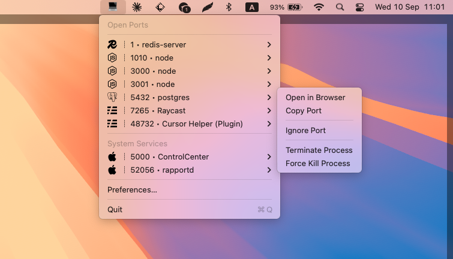

# Open Ports Menubar

<div align="center">

A lightning-fast macOS menu bar app for monitoring and managing network ports

[](https://github.com/Nati-elimelech/open-ports-menubar/releases)
[](https://opensource.org/licenses/MIT)
[](https://www.apple.com/macos/)
[](https://support.apple.com/en-us/HT211814)

[](https://www.electronjs.org/)
[](https://nodejs.org/)
[](https://www.docker.com/)
[](https://www.apple.com/macos/)

</div>

## Screenshot

<div align="center">

</div>

## Features

**Real-time Port Monitoring** - Live view of all open TCP ports on your system  
**Docker Integration** - Automatically detects and displays Docker container ports  
**Process Management** - Instantly terminate or kill processes directly from the menu  
**Smart Filtering** - Hide system ports, Docker ports, or create custom ignore rules  
**Native macOS Design** - Seamlessly integrates with your menu bar  
**Customizable** - Adjustable refresh intervals and display preferences  
**Lightweight** - Minimal CPU and memory footprint  

## Installation

### Download Pre-built App

Download the latest `.dmg` file from the [Releases](https://github.com/Nati-elimelech/open-ports-menubar/releases) page.

### Build from Source

```bash
# Clone the repository
git clone https://github.com/Nati-elimelech/open-ports-menubar.git
cd open-ports-menubar

# Install dependencies
npm install

# Run in development mode
npm start

# Package for macOS
npm run make
```

The packaged app will be in the `out/make/` directory as a DMG file.

**Note for packaged apps:** The app uses ad-hoc signing (self-signing). When opening the DMG downloaded from the internet, macOS may show a security warning. To open:
- Right-click the app and select "Open", or
- Go to System Settings > Privacy & Security and click "Open Anyway"

## Usage

1. **Launch the app** - The app icon will appear in your menu bar
2. **Click the icon** - View all open ports with their associated processes
3. **Interact with ports**:
   - Click on any port to see available actions
   - Open in browser (for web services)
   - Copy port number to clipboard
   - Terminate or force kill the process
   - Add to ignore list

### Preferences

Access preferences to customize:
- **Refresh Interval**: How often to scan for ports (1-60 seconds)
- **Display Options**: 
  - Show/hide Docker container ports
  - Show/hide macOS system services
  - Show service names for known applications
- **Ignore Rules**: Add port numbers or process names to filter out

<div align="center">

</div>

## System Requirements

- **macOS**: Big Sur (11.0) or later
- **Architecture**: Apple Silicon (arm64) native, Intel (x64) via Rosetta 2
- **Node.js**: 18.0.0 or later (for development)
- **npm**: 8.0.0 or later (for development)
- **System Commands**: 
  - `lsof` (included with macOS)
  - Docker CLI (optional, for Docker port detection)

## Technology Stack

- [Electron](https://www.electronjs.org/) v31.3.0 - Cross-platform desktop framework
- [electron-store](https://github.com/sindresorhus/electron-store) v9.0.0 - Persistent preferences
- [electron-forge](https://www.electronforge.io/) v7.9.0 - Build and packaging tools
- Native macOS APIs for menu bar integration
- Shell commands (`lsof`, `docker ps`) for port scanning

### Compatibility

- **Electron**: 31.x (uses Chromium 126, Node.js 20.15.1)
- **Package Type**: ES Modules (`"type": "module"`)
- **Build Target**: macOS 11.0+

## Development

### Project Structure

```
open-ports-menubar/
├── src/
│   ├── main.js           # Main process & tray management
│   ├── preferences.html   # Settings window UI
│   ├── preferences.js     # Settings window logic
│   ├── preload.js        # Preload script for IPC
│   └── services/
│       ├── ports.js      # Port scanning logic
│       ├── config.js     # System process definitions
│       └── iconRegistry.js # Icon management
├── assets/
│   └── icons/           # Application icons
└── forge.config.mjs     # Electron Forge configuration
```

### Available Scripts

```bash
npm start        # Run in development mode
npm run package  # Package the app
npm run make     # Create distributable (.dmg)
```

### Performance Notes

The app uses performance logging with the `[AI-PERF]` prefix to track operation timings during development.

## Contributing

Contributions are welcome! Please feel free to submit a Pull Request.

1. Fork the repository
2. Create your feature branch (`git checkout -b feature/AmazingFeature`)
3. Commit your changes (`git commit -m 'Add some AmazingFeature'`)
4. Push to the branch (`git push origin feature/AmazingFeature`)
5. Open a Pull Request

## Icon Attribution

This application uses icons that may be trademarks or registered trademarks of their respective owners:

- **Node.js** is a trademark of Joyent, Inc.
- **Docker** and the Docker logo are trademarks of Docker, Inc.
- **MySQL** is a trademark of Oracle Corporation
- **PostgreSQL** is a trademark of the PostgreSQL Global Development Group
- **MongoDB** is a trademark of MongoDB, Inc.
- **Redis** is a trademark of Redis Ltd.
- **nginx** is a registered trademark of F5, Inc.
- **Apache** is a trademark of the Apache Software Foundation
- **Git** is a trademark of the Software Freedom Conservancy
- **Python** is a trademark of the Python Software Foundation
- **Apple**, **macOS**, and related system service names are trademarks of Apple Inc.

All icons are used for identification purposes only. Open Ports Menubar is an independent application and has not been authorized, sponsored, or otherwise approved by any of the above-mentioned organizations.

## Privacy

Open Ports Menubar runs entirely locally on your machine. It does not collect, store, or transmit any data to external servers. All preferences are stored locally using Electron's storage APIs.

## Credits

This project is built with excellent open source software. See [CREDITS.md](CREDITS.md) for full acknowledgments and attribution.

## License

Copyright (c) 2024 [Nati Elimelech](https://www.natielimelech.com)

Licensed under the MIT License - see the [LICENSE](LICENSE) file for details.

## Author

**Nati Elimelech**  
Website: [natielimelech.com](https://www.natielimelech.com)

---

<div align="center">

Made for the macOS community

</div>